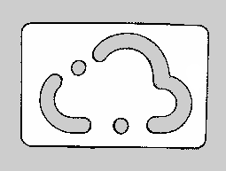

# Overview

## Overview Clober on ROS1 Noetic

### Clober!

This project currently contains some basic support drivers and navigation packages for the Clober Robot research platform. We will be providing higher level packages soon, probably relatively prior to the 2021 ROScon schedule. Have fun using our packages and hope to see you at ROScon!

[](https://opensource.org/licenses/Apache-2.0)
[](https://travis-ci.com/github/clobot-git/clober/builds)

## Index
* [1. Installations](./#1-installations)
* [2. Basic Bringup](./#2-basic-bringup)
* [3. SLAM & Navigation](./#3-SLAM-&-Navigation)
* [4. Gazebo Simulations](./#4-Gazebo-Simulations)

### 1. Installations
#### 1. \([http://wiki.ros.org/noetic/Installation](http://wiki.ros.org/noetic/Installation) "ROS1 Noetic Installation Guide"\)
```bash
sudo sh -c 'echo "deb http://packages.ros.org/ros/ubuntu $(lsb_release -sc) main" > /etc/apt/sources.list.d/ros-latest.list'
  sudo apt-key adv --keyserver 'hkp://keyserver.ubuntu.com:80' --recv-key C1CF6E31E6BADE8868B172B4F42ED6FBAB17C654
  curl -sSL 'http://keyserver.ubuntu.com/pks/lookup?op=get&search=0xC1CF6E31E6BADE8868B172B4F42ED6FBAB17C654' | sudo apt-key add -
  sudo apt update
  sudo apt install ros-noetic-desktop-full
  source /opt/ros/noetic/setup.bash
  echo "source /opt/ros/noetic/setup.bash" >> ~/.bashrc
  source ~/.bashrc
  sudo apt install python3-rosdep python3-rosinstall python3-rosinstall-generator python3-wstool build-essential
  sudo apt install python3-rosdep
  sudo rosdep init
  rosdep update
```
#### 2. Install specific packages available in ROS
  ```text
    sudo apt install ros-noetic-PACKAGE
  ```
  e.g.)
  ```text
    sudo apt install ros-noetic-slam-gmapping
  ```
  To find available packages, see ROS Index or use :
  ```text
    apt search ros-noetic
  ```

#### 3. Create a catkin workspace directory

  ```text
  mkdir -p ~/test_ws/src && cd ~/test_ws/src
  catkin_init_workspace 
  cd ~/test_ws/
  catkin_make
  ```

#### 4. Download Clober files

  ```text
  cd ~/test_ws/src
  wget https://raw.githubusercontent.com/clobot-git/clober/noetic-devel/clober.repos
  wget https://raw.githubusercontent.com/clobot-git/clober-msgs/noetic-devel/clober-msgs.repos
  vcs import src < clober.repos
  vcs import src < clober.repos
  ```

#### 5. Intialize Clober ttyUSB nodes, Clober\_init.sh is needed to be run only once for the first setup.

```bash
cd ~/catkin_ws/src/clober/
sudo ./clober.sh
```

#### 6. compile the packages

```bash
cd ~/catkin_ws/
source /opt/ros/noetic/setup.bash
catkin_make
source ~/catkin_ws/devel/setup.bash
```

### 2. Basic Bringup

**Launch Clober**

```bash
source /opt/ros/noetic/setup.bash
source ~/catkin_ws/devel/setup.bash
roslaunch clober_bringup base.launch
```

#### SLAM your map with Clober

**1. Launch SLAM \(gmapping\)**
```bash
source /opt/ros/noetic/setup.bash
source ~/catkin_ws/devel/setup.bash
roslaunch clober_slam clober_slam.launch
```

**2. Teleop with Clober**
```bash
source /opt/ros/noetic/setup.bash
rosrun teleop_twist_keyboard teleop_twist_keyboard
```

**3. Save the map**
```bash
source /opt/ros/noetic/setup.bash
rosrun map_server map_saver -f <map_dir>/<map_name> --ros-args -p save_map_timeout:=10000
```

### 3. SLAM & Navigation

#### 1. Launch Navigation
```bash
roslaunch clober_navigation navigation.launch map:=<full_path_to_your_map_name.yaml>
```

#### 2. Set Initialpose
> Click "2D Pose Estimate", and set estimation to the approximate location of robot on the map.

#### 3. Set Goal
> Click "2D Nav Goal", and set goal to any free space on the map.

### 4. Gazebo Simulations

**1. Bringup Simulations and Teleoperater**
```bash
source /opt/ros/noetic/setup.bash
source ~/catkin_ws/devel/setup.bash
roslaunch clober_simulation clober_logo_stage.launch
rosrun teleop_twist_keyboard teleop_twist_keyboard
```
video: [https://youtu.be/EJVVEIdjzRk](https://youtu.be/EJVVEIdjzRk)

**2. Run SLAM to get the map of the simulated world**

```bash
roslaunch clober_slam clober_slam.launch
```
video: https://youtu.be/E6kSsZyf7A8 \
Your saved map may look like the following \


**3. Navigate the simulated world by clicking on 2d\_nav\_goal**
```bash
roslaunch clober_navigation navigation.launch map:=<full_path_to_your_map_name.yaml> 
```
video: https://youtu.be/JkfhGiDO2JA
