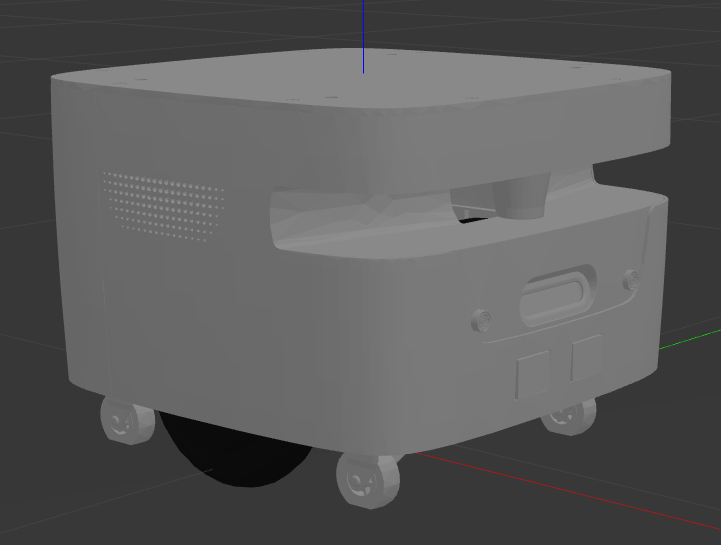

# Clober!

**Clober is a next-generation robot research platform from** [**Clobot**](https://www.clobot.co.kr/) that is specifically targeting research systems that require multi-robot hardware possible to attach and detach accessories. Here we provide basic robot packages as opensource resources for you to utilize over your course of research. The goal of Clober is to reduce production costs while increasing functionality and quality in order to introduce a platform to control multiple robots into research centers

For researchers, robotics developers, students, and other users, the code for all feature of clober is provided opensource. Use clover and this code to bring your algorithms into the real world and apply robots to your applications, and also contribute to ROS community.

---
## Feature of clober
### Simulation

We provide gazebo-based simulation for rapid prototyping of robotic algorithm development and users who find it difficult to drive robots in real environments.

|Real|Simlation|
|:---:|:---:|
|||

### SLAM and Navigation
Basic SLAM and Navigation algorithms are implemented using ROS-based acml and move-base packages.

### Multiple Clober

For multi-robot applications, we adapt open-source fleet management system RMF(Robotics Middleware Framework) to clober. So, you can deal with schedule and traffic control, task management of multi clober or other robots.

Please see our other repository [clober_free_fleet](https://github.com/CLOBOT-Co-Ltd/clober_free_fleet/tree/dev).

---
## ROS Packages for Clober

|ROS1|Noetic + Ubuntu Focal|ROS2|Foxy + Ubuntu Focal|Galactic|
|:---:|:---:|:---:|:---:|:---:|
|Branch|[`neotic-branch`](https://github.com/clobot-git/clober/tree/noetic-devel)|Branch|[`foxy-devel`](https://github.com/clobot-git/clober/tree/foxy-devel)| TBD |
|Travis-CI||Travis-CI|| TBD |
| | |Linter|| TBD |

## Clobot gitbook for Clober Manual
- [Manual for Clober](https://app.gitbook.com/@clobot-git/s/clober-manual/)

## **Wiki** for Clober Packages
<!--- 
TODO : Add package description
--->
|Package|Description|
|:---:|:---:|
|clober| Meta package |
|clober_bringup| launch files to bring up the sensor drivers and hardware interface for real clober |
|clober_description| URDF description of clober |
|clober_navigation| navigation based on move_base package |
|clober_serial| hardware interface package using serial communication |
|clober_simulation| simulation specific launch and configuration files for clober |
|clober_slam| configuration and launch file for SLAM which create a map of the environment and localize clober's position on the map. |
|clober_teleop| configuration and launch file for teleoperation |

- http://wiki.ros.org/clober 
- http://wiki.ros.org/clober_bringup 
- http://wiki.ros.org/clober_description
- http://wiki.ros.org/clober_teleop
- http://wiki.ros.org/clober_slam
- http://wiki.ros.org/clober_navigation
- http://wiki.ros.org/clober_simulation

## Clobot developed Opensource packages
- [ FreeFleet ](http://wiki.ros.org/RMF/FreeFleet)
- [ Scheduler ](http://wiki.ros.org/RMF/Scheduler)
- [ Multi Map Traffic Editor ](http://wiki.ros.org/RMF/traffic_editor)

## Pages Relevant to Clober
- [ Clobot Homepage ](https://www.clobot.co.kr/)
- [ Clobot YouTube ](https://www.youtube.com/channel/UCau5FLJpMxhvW-IHZ8c8qKQ/featured/)

